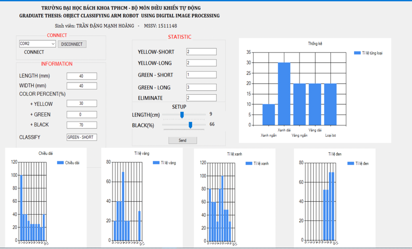

# User-interface tool for display and visualize data of fruit in object classifying project

## 1. Purpose
This project is the C# application to build a UI to display and visualize the data of banana that collect from image and process by digital image processing

The banana is collected based on the size (length, height) and the color pixels. Then they are classified based on their color (green, yellow) and the size (long, short). The classification result is stored, displayed, and visualized on the UI described as below

## 2. UI

Data displayed on the UI
+ The length and height of the object
+ The percentage of color pixels (3 colors: green, yellow, black)
+ Classification

Data visualized on the UI
+ Statistics of the amount of each type of objects based on the classification
+ Statistics of the amount of each type of objects based on 4 factors

